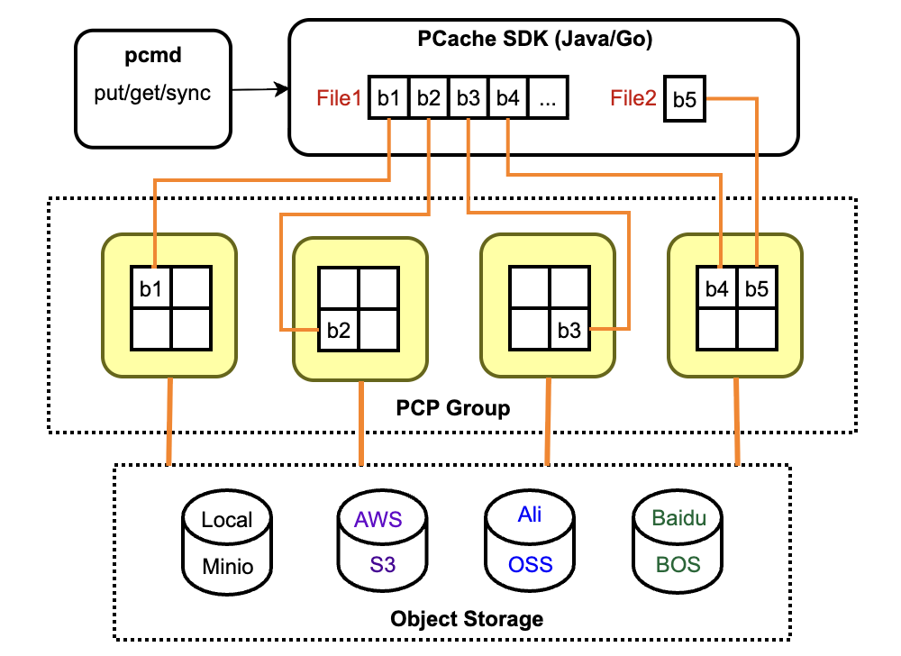
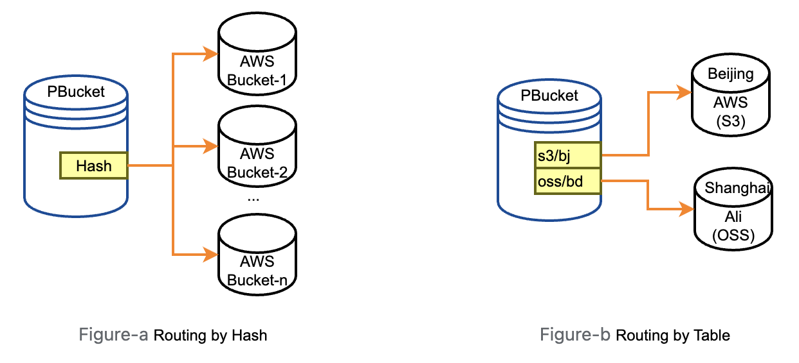
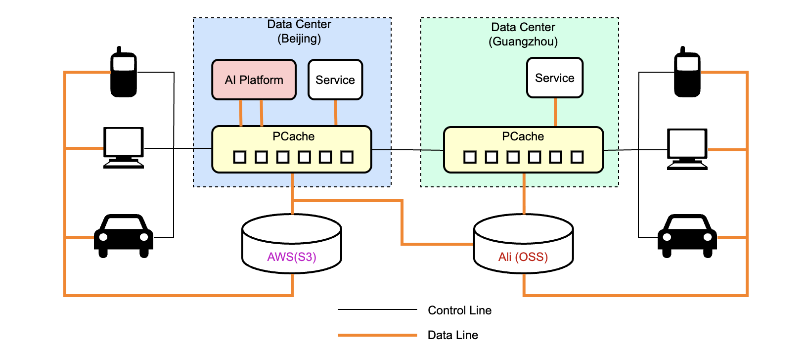
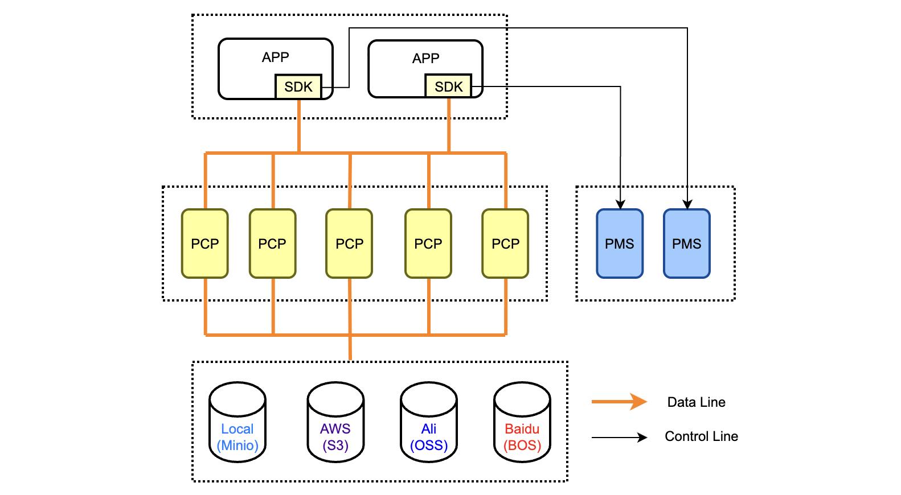

**PCache (Parallel Cache) for Object Storage** - A simple, high-performance, low-cost parallel caching system focused on improving object storage performance. Released under the Apache 2.0 open-source license. PCache abstracts away differences between backend object storage vendors, enabling easy improvement of data throughput for big data, machine learning, artificial intelligence, and various application platforms. -> [To Chinese](README_CN.md)

## Architecture
Files are split into blocks and cached across multiple cache nodes (PCPs). Clients read from/write to files in parallel from multiple PCPs. If a file is not in the cache, it triggers multiple PCPs to pull data in parallel from the backend object storage. Different files are stored on different cloud vendors or regions according to routing rules, but are all cached on the local distributed PCP nodes.

<div align="center">

</div>

## Highlighted Features
**Parallel Cache (PCache)** Focuses solely on high performance; reliability is guaranteed by the backend object storage.

* File blocks are cached across multiple PCP nodes for parallel read/write operations. PCP focus only on the speed of data block download/upload.

* The Parallel Meta Service (PMS) manages PCPs via consistent hashing. Clients access PCP nodes directly.

**Parallel Bucket (PBucket)** A virtual bucket, backed by one or a group of cloud vendor buckets, which can span clouds and regions.

* Supports defining data routing rules, allowing data to be routed to specific clouds, regions.

* Supports defining lifecycle policies (TTL), specifying data retention periods in different storage types (hot/cold/archive).

* Supports AK/SK and IAM, independent backend object storage, managing resource/interface permissions by setting policies and role authorizations.

**Multi-Cloud Support** Any cloud vendor supporting the basic S3 interface can be integrated. Verified vendors include (AWS S3, Alibaba Cloud OSS, Baidu Cloud BOS, Volcano Engine TOS, MinIO).

**SDK Support** PBuckets can be accessed via SDKs. Currently supported languages are Java/Go.
<div align="center">

</div>

## User Story
Massive numbers of smart devices are distributed across various locations, uploading data to public cloud object storage from nearby locations. Users access data via mobile phones or computers. AI training platforms, big data services, and business services are deployed in central high-speed networks and need to read/save data from/to object stores everywhere in high-speed batches.

<div align="center">

</div>

## Modules
PCache consists of four modules:

### Parallel Meta Service (PMS)
* Manages Meta such as cloud vendors and PBuckets. For details, refer to [Meta Storage Solution](docs/en/meta.md)。

* Provides STS authentication services for multiple cloud vendors, granting clients access permissions to object storage.

* Manages cache nodes (PCPs) and provides clients with a list of available PCPs.

* Supports Multi-PMS deployment.[How to use multiple PMS](docs/en/multi-pms.md).

### Parallel Cache Node (PCP)
* A file block server implemented using Netty, focused on high-speed upload/download of file blocks.

* Implements cache eviction algorithms. Periodically scans through cached data blocks in the background to delete cold data.

* Registers with the PMS upon startup for availability.

### Client SDK
* Retrieves STS credentials and the list of available PCPs from the nearby PMS node.

* Performs concurrent read/write operations on data chunks from/to PCPs and assembles files.

### Command-line tool pcmd
* Calls the SDK interface to complete the file/directory upload and download functionality. For example, you can synchronize data under a prefix of a PBucket to a local directory in parallel using the following command. For more usage, refer to:  [pcmd usage](pcmd/README.md)。
    ```
    ./pcmd sync s3://pbucket-name/prefix/ /tmp/folder 
    ```

<div align="center">

</div>

## Data Security
An independent security authentication system is employed. Both APIs and PBuckets are accessed via AK/SK and authorized through IAM. For details, refer to [Configure Interface Authentication (Token) Guide](docs/en/api_token.md).

## Performance Test
Simple Small File Test

**Test Method**：Access Baidu Object Storage (BOS) via public network to batch synchronize 10,000 small files, each 2 KB in size.

**Test Machines**： 
* Machine A: System (Ubuntu), Memory (16G), deployed with PMS/PCP
* Machine B: System (MacOS), Memory (16G), deployed with PCP/PCMD

| Operation|Time Taken (seconds)| Cache Hit Rate |S3cmd Reference |
|-----------|----------------|----------|----------|
| First Upload | 204 	   |  0% | 624 |
| First Download | 150		|  0% | 584  |
| Second Download | 7     	|  100% | 581 |

**Test Conclusion：**
*   With 2 PCP nodes and a 100% cache hit rate, the second download is 20 times faster than the first download.
*   With 2 PCP nodes, even the first upload/download is more than three times as fast compared to directly using S3cmd.

**Commands Used:**
  ```
  pcmd sync /tmp/small_2k_10k s3://pb-bos/test/pcmd/sync/small_2k_10k/
  pcmd sync s3://pb-bos/test/pcmd/sync/small_2k_10k/ /tmp/small_2k_10k/
  ```
## Getting Started
Please refer to the [Quick Start Guide](docs/en/startup.md) to start using PCache immediately!

## Contribution
Please refer to [Contributing Code](docs/en/contribute.md). Thank you for your contributions to the PCache community!!

## Milestone
| Version | Features 								     |
|---------|----------------------------------------------|
| 0.2.0   | Improve existing features and bug fixes 	 |
| 0.3.0   | Support erasure coding for cache writing	 |
| 0.4.0   | Python SDK support    					     |
| 0.5.0   | Support POSIX protocol for data read/write   |

## Maintainers
agile.yang@gmail.com

28581556@qq.com


