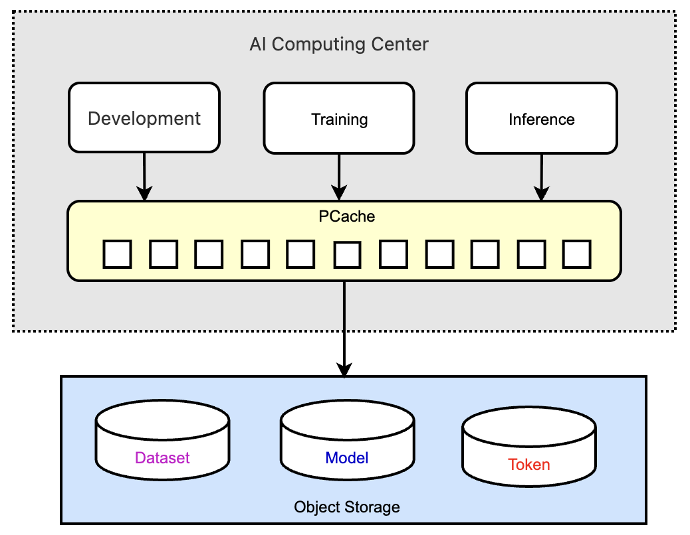

PCache(Parallel Cache) 一款简单｜高性能｜低成本的并行缓存系统，专注于提高对象存储性能。在 Apache 2.0 开源协议下发布。PCache 屏蔽后端对象存储厂商差异。可以便捷的提高大数据、机器学习、人工智能以及各种应用平台数据吞吐。

## 技术架构
文件缓存在多个缓存节点（PCP）上，大文件分块缓存，客户端从多个 PCP 并行读取/写入文件。如文件不在缓存，触发多个 PCP 节点并行从后端对象存储上拉数据。不同的文件按路由规则存储在不同的云厂商或地域上，但都会缓存在本地分布式 PCP 节点上。
<div align="center">

</div>

## 核心特性
### 1. 基于对象存储的并行缓存（PCache）
   * PCache 基于对象存储基础设计，逻辑简单，只关心高性能, 可靠性|扩展性由后端对象存储保障。
   * PCache 可对已有的对象存储数据直接加速，无需 Meta 转换。
   * 大文件分块，小文件分散缓存到多个PCP节点，提供高带宽｜高QPS存储服务。 
   * 缓存节点（PCP）通过一致性哈希管理。客户端直接访问 PCP 节点。

### 2. 并行桶（PBucket）
  * 支持多云，PBucket 对应一个或一批云厂商桶。已验证有（AWS-S3，阿里-OSS, 百度-BOS，火山-TOS, Minio）
  * 负载均衡，高并发场景，一个 PBucket 对应一批供应商Bucket；高可靠性场景，一个 PBucket 对应多区域多供应商桶。
  * 支持定义生命周期（TTL），定义数据在不同类型存储（热/冷/归档）保存时间。
  * 支持 AK/SK/IAM，独立后端对象存储，通过设置策略和角色授权资源/接口权限。
<div align="center">

</div>


### 3. 命令行支持
提供 pcmd 命令行工具，调用Go SDK实现, 通过命令行访问数据(put/get/sync)。其中 sync 命令可按多种策略(存在/大小/指纹) 同步本地目录和PBucket 前缀之间的数据。
```
// sync local folder '/tmp/meta' to pbucket 'test-minio' prefix 'test/pcom/sync/meta'
$ ./pcmd sync /tmp/meta s3://test-minio/test/pcom/sync/meta

// sync pbucket 'test-minio' prefix 'test/pcom/sync/meta' to local folder '/tmp/meta'
$ ./pcmd sync s3://test-minio/test/pcom/sync/meta /tmp/meta

$ ./pcmd sync -h
Usage of sync:
  -block-thead-number int
    	thread number of block worker (default 8)
  -checksum string
    	checksum file for verify or compare, crc32 or md5
  -debug
    	debug mode
  -dry
    	dry run mode
  -http-timeout-factor float
    	block http timeout factor (default 1)
  -skip-existing
    	skip existing file or object
  -skip-unchanged
    	skip unchanged file or object with size for checksum  	
```
### 4. SDK 支持
可通过 SDK 访问 PBucket，已支持的语言有 Java/Go。

## 典型场景
### 1.AI训练推理场景
使用对象存储统一管理多种类型数据，使用PCache 按需提供多场景加速。
* 训练时通过PCache加载训练数据集，支持预热。生成模型保存到PCache 后可直接供推理使用，最终同步到对象存储。
* 推理时从PCache 加载模型，如模型不存在则自动从后端对象存储加载。
* 推理预填充阶段(Prefill)大量Token保存到PCache，解码阶段(Decode)直接从PCache加载Token。也可选择是否需要持久 Token化到对象存储。
<div align="center">

</div>

### 2.智能驾驶场景
海量车机分布在各地，设备就近上传到公有云对象存储。用户通过手机或电脑访问数据。AI练平台/大数据/业务服务部署在中心高速网络，需要批量高速读取车机上传到各处对象存储数据。
PCache 在各数据中心为各种服务提供统一数据界面，屏蔽云厂商地域差异，提供高速存储服务。
<div align="center">

</div>

## 主要模块
PCache 由四个部分组成：
### 并行元数据服务（PMS）
   * 管理云厂商/PBucket 等信息，详见[Meta存储方案](docs/cn/meta.md)。
   * 提供多种云厂商 STS 认证服务，提供客户端访问对象存储权限。
   * 管理缓存节点（PCP），提供客户端可用缓存节点列表。
   * 可多点部署 PMS。[部署多个 PMS ](docs/cn/multi-pms.md).
     
### 并行缓存节点（PCP）
   * 使用 netty 实现的文件快服务器，专注于文件块上传/下载速度。
   * 缓存淘汰算法。后台定时便利缓存数据块，删除冷数据。
   * 启动后注册到 PMS 备用。
     
### 客户端 SDK
   * 从最近 PMS 节点获取 STS 权限，可用 PCP 列表。
   * 从 PCP 并发读/写数据块，合成文件。

### 命令行工具 pcmd
* 调用 SDK 接口完成文件/目录的上传下载功能。例如，可通过以下命令并行同步 PBucket 的前缀下数据到本地目录，更多用法参见 [pcmd 使用方式](pcmd/README.md)。
    ```
    ./pcmd sync s3://pbucket-name/prefix/ /tmp/folder 
    ```
  
## 数据安全
独立的安全认证体系，接口和 PBuckt 都通过 AK/SK 访问，通过 IAM 授权。详见[配置接口认证（Token）指南](docs/cn/api_token.md)

## 验证测试
简单小文件测试

**测试方式**：通过公网访问百度对象存储BOS，批量同步 10000 小文件，每个文件2KB。

**测试机器**： 
* 机器A：系统（Ubuntu）内存（16G）部署PMS/PCP  
* 机器B：系统（MacOS）内存（16G）部署PCP/PCMD

| 操作    | 耗时（秒）	         | Cache命中率 | S3cmd 参照 |
|-----------|----------------|----------|----------|
| 第一次上传 | 204 	   |  0% | 624 |
| 第一次下载 | 150		|  0% | 584  |
| 第二次下载 | 7     	|  100% | 581 |

**测试结论：**
*   2个PCP节点，100%命中率，第二次下载比第一次下载速度提高20倍
*   2个PCP节点，即使第一次上传下载也比直接用 S3cmd 快3倍多。

**操作命令**
  ```
  pcmd sync /tmp/small_2k_10k s3://pb-bos/test/pcmd/sync/small_2k_10k/
  pcmd sync s3://pb-bos/test/pcmd/sync/small_2k_10k/ /tmp/small_2k_10k
  ```


## 开始使用
请参照 [快速上手指南](docs/cn/startup.md) 立即开始使用 PCache！

## 代码提交
请参照 [贡献代码](docs/cn/contribute.md) 感谢你对 PCache 社区的贡献！！

## 开发计划

| 版本    | 功能 								 | 状态  |
|-------|---------|-----|
| 0.2.0 | 基本功能 ｜运行部署 | 完成  |
| 0.2.0 | bugfix ｜pcmd 命令行工具 | 完成  |
| 0.3.0 | 异步写优化  | 进行中 |
| 0.4.0 | Meta 缓存 ｜ RDMA支持 | 计划中 |

## 维护人员
28581556@qq.com

agile.yang@gmail.com

